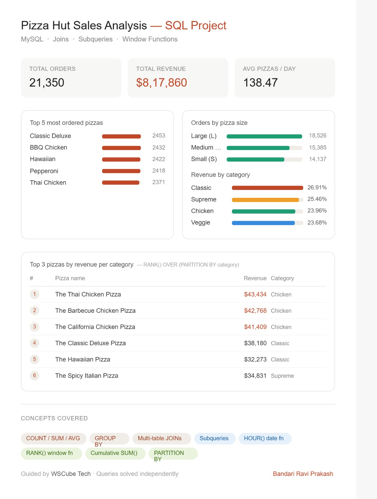

# 🍕 Pizza Hut Sales Analysis — SQL Project

A complete end-to-end SQL Data Analysis Project built using the Pizza Hut sales dataset.

This project focuses on solving real-world business problems using SQL concepts like:

- Joins
- Subqueries
- Window Functions
- Aggregate Functions
- CTEs & Ranking Logic

The goal of this project is to analyze Pizza Hut sales data and extract meaningful business insights.

---

# 📌 Project Overview

This SQL project analyzes Pizza Hut order data to uncover:

- Total Revenue Generated
- Best Selling Pizzas
- Customer Ordering Patterns
- Revenue Contribution by Category
- Peak Order Hours
- Daily Revenue Trends
- Top Performing Pizza Categories

This project is beginner-friendly while also covering advanced SQL concepts used in real analytics work.

---

# 🛠️ Tech Stack

| Technology | Usage |
|------------|-------|
| MySQL | Database Management |
| SQL | Data Analysis |
| CSV Dataset | Raw Data Source |

---

# 📂 Database Schema

The project uses 4 tables:

## 1️⃣ Orders Table

| Column Name | Data Type |
|-------------|-----------|
| order_id | INT |
| order_date | DATE |
| order_time | TIME |

---

## 2️⃣ Order Details Table

| Column Name | Data Type |
|-------------|-----------|
| order_details_id | INT |
| order_id | INT |
| pizza_id | TEXT |
| quantity | INT |

---

## 3️⃣ Pizzas Table

| Column Name | Data Type |
|-------------|-----------|
| pizza_id | TEXT |
| pizza_type_id | TEXT |
| size | TEXT |
| price | FLOAT |

---

## 4️⃣ Pizza Types Table

| Column Name | Data Type |
|-------------|-----------|
| pizza_type_id | TEXT |
| name | TEXT |
| category | TEXT |

---

# 📊 Business Questions Solved

## Basic Analysis

1. What is the total number of orders placed?
2. What is the total revenue generated?
3. Which pizza has the highest price?
4. Which pizza size is ordered the most?
5. What are the top 5 best-selling pizzas?

---

## Intermediate Analysis

6. How are orders distributed by category?
7. During which hours are most orders placed?
8. How many pizza varieties exist in each category?
9. What is the average number of pizzas ordered per day?
10. Which pizzas generate the highest revenue?

---

## Advanced Analysis

11. What percentage of total revenue comes from each category?
12. How does cumulative revenue grow over time?
13. Which are the top 3 revenue-generating pizzas within each category?

---

# 🔥 SQL Concepts Covered

## Core SQL

- SELECT
- WHERE
- ORDER BY
- GROUP BY
- LIMIT
- Aggregate Functions

---

## Joins

- INNER JOIN
- LEFT JOIN
- Multi-table JOINs

---

## Advanced SQL

- Subqueries
- Window Functions
- RANK()
- PARTITION BY
- Cumulative SUM
- HOUR() Function

---

# 📈 Key Insights

- Large-sized pizzas contributed the highest order volume.
- Classic category generated the highest revenue share.
- Peak ordering activity occurred during afternoon and evening hours.
- Thai Chicken Pizza generated the highest revenue.
- Revenue consistently increased throughout the year.

---

# 📷 Dashboard Preview



---

# 🚀 How to Run This Project

## 1️⃣ Create Database

```sql
CREATE DATABASE pizzahut;
```

---

## 2️⃣ Import CSV Files

Import all CSV datasets into MySQL tables.

---

## 3️⃣ Run SQL Queries

Execute all queries from the `sql_queries.sql` file.

---

# 📁 Project Structure

```bash
Pizza-Hut-Sales-Analysis/
│
├── datasets/
│   ├── orders.csv
│   ├── order_details.csv
│   ├── pizzas.csv
│   └── pizza_types.csv
│
├── sql_queries.sql
├── dashboard.png
└── README.md
```

---

# 💡 Learning Outcomes

Through this project, I learned:

- Writing optimized SQL queries
- Solving real-world business problems using SQL
- Using Window Functions effectively
- Performing data analysis using relational databases
- Understanding sales and revenue analytics

---

# 🧠 Future Improvements

- Build Power BI Dashboard
- Add Customer Analytics
- Create SQL Views & Stored Procedures
- Optimize Query Performance
- Deploy on Cloud Database

---

# 👨‍💻 Author

## Bandari Ravi Prakash


---

# ⭐ Support

If you found this project useful, give it a ⭐ on GitHub.
